# GUIA DE CURADORIA VISUAL DOS ÍCONES — THE BRAND BOX
**Estrutura Interna Pós-Curadoria Manual da Designer** | *The Brand Box Design System*

## 1. RESUMO GERAL DAS PASTAS DE ESTILO

| Pasta no Projeto | Nome do Estilo | ID no Sistema | Total de Ícones Ativos | Top 3 Destaques (`featured: true`) |
|---|---|---|---|---|
| `public/icons/styles/doce-encantamento/` | **Doce Encantamento** | ID 8 | **11** | `doce bird 47`, `doce bird 50`, `doce sol` |
| `public/icons/styles/escandinavo-acolhedor/` | **Escandinavo Acolhedor** | ID 3 | **10** | `scandi barco minimal`, `scandi casa minimal`, `scandi heart minimal` |
| `public/icons/styles/essencia-atemporal/` | **Essência Atemporal** | ID 5 | **7** | `essencia florr de sal`, `essencia floral do mar`, `essencia concha` |
| `public/icons/styles/estetico-editorial/` | **Estético Editorial** | ID 11 | **8** | `estetico organico`, `estetico natural`, `estetico flexibilidade` |
| `public/icons/styles/jardim-encantado/` | **Jardim Encantado** | ID 2 | **6** | `flor delicadeza suave`, `passaro fofura amigavel`, `flor de tulips` |
| `public/icons/styles/raizes-e-cuidado/` | **Raízes & Cuidado** | ID 6 | **8** | `raiz organico`, `raiz naturral organico caule`, `raiz naturral organico flor mdoerno bold` |

---

## 2. CATÁLOGO VISUAL DETALHADO POR ESTILO

### Estilo: Doce Encantamento (ID 8) — Pasta: `doce-encantamento/`

| Miniatura | Ordem | Status | Nome do Arquivo | ID Estável | Label | Origem / Nota |
|---|---|---|---|---|---|---|
| 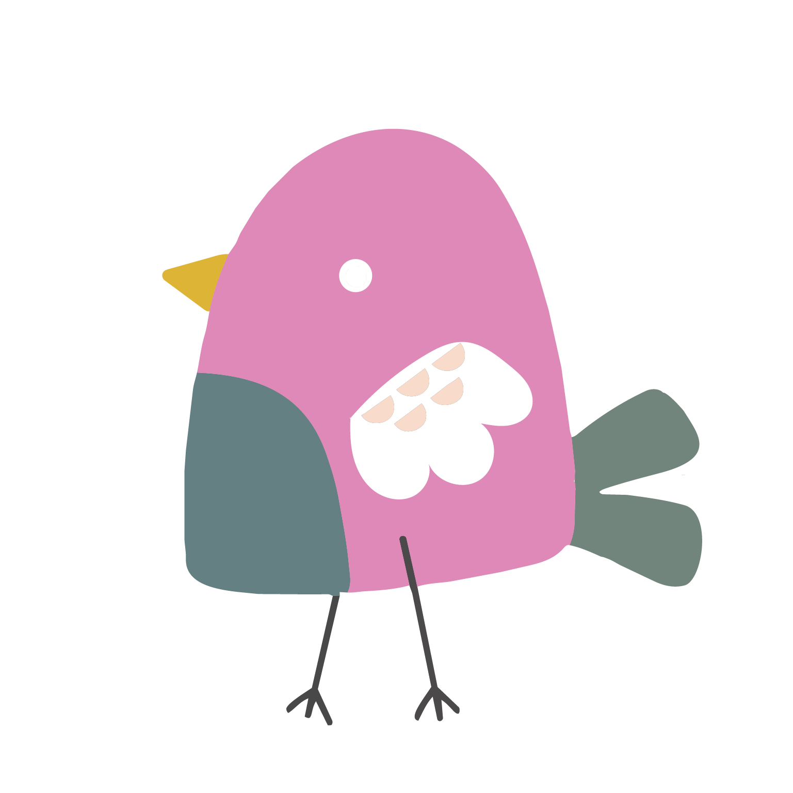 | ⭐ **Top 1 (Destaque)** | `active` | `1.icon-_icon-doce-bird-47.png` | `icon-_icon-doce-bird-47` | doce bird 47 | Legado: `/icons/icon-_icon-doce-bird-47.png` |
|  | ⭐ **Top 2 (Destaque)** | `active` | `2.icon-_icon-doce-bird-50.png` | `icon-_icon-doce-bird-50` | doce bird 50 | Legado: `/icons/icon-_icon-doce-bird-50.png` |
|  | ⭐ **Top 3 (Destaque)** | `active` | `3.icon-_icon-doce-sol.png` | `icon-_icon-doce-sol` | doce sol | Legado: `/icons/icon-_icon-doce-sol.png` |
|  | Opção (4) | `active` | `4.icon-_icon-doce-rainbow.png` | `icon-_icon-doce-rainbow` | doce rainbow | Legado: `/icons/icon-_icon-doce-rainbow.png` |
|  | Opção (5) | `active` | `5.icon-_icon-doce-bee.png` | `icon-_icon-doce-bee` | doce bee | Legado: `/icons/icon-_icon-doce-bee.png` |
|  | Opção (6) | `active` | `6.icon--51.png` | `icon--51` |  51 | Legado: `/icons/icon--51.png` |
|  | Opção (7) | `active` | `7.icon.png` | `icon-doce-encantamento-doce-e-07` | doce encantamento doce e 07 | ✨ **Novo** |
|  | Opção (8) | `active` | `8.icon.png` | `icon-doce-encantamento-doce-e-08` | doce encantamento doce e 08 | ✨ **Novo** |
|  | Opção (9) | `active` | `9.icon.png` | `icon-doce-encantamento-doce-e-09` | doce encantamento doce e 09 | ✨ **Novo** |
|  | Opção (10) | `active` | `10.icon.png` | `icon-doce-encantamento-doce-e-10` | doce encantamento doce e 10 | ✨ **Novo** |
|  | Opção (11) | `active` | `11.icon.png` | `icon-doce-encantamento-doce-e-11` | doce encantamento doce e 11 | ✨ **Novo** |

### Estilo: Escandinavo Acolhedor (ID 3) — Pasta: `escandinavo-acolhedor/`

| Miniatura | Ordem | Status | Nome do Arquivo | ID Estável | Label | Origem / Nota |
|---|---|---|---|---|---|---|
|  | ⭐ **Top 1 (Destaque)** | `active` | `1.icon-_icon-scandi-barco-minimal.png` | `icon-_icon-scandi-barco-minimal` | scandi barco minimal | Legado: `/icons/icon-_icon-scandi-barco-minimal.png` |
|  | ⭐ **Top 2 (Destaque)** | `active` | `2.icon-_icon-scandi-casa-minimal.png` | `icon-_icon-scandi-casa-minimal` | scandi casa minimal | Legado: `/icons/icon-_icon-scandi-casa-minimal.png` |
|  | ⭐ **Top 3 (Destaque)** | `active` | `3.icon-_icon-scandi-heart-minimal.png` | `icon-_icon-scandi-heart-minimal` | scandi heart minimal | Legado: `/icons/icon-_icon-scandi-heart-minimal.png` |
|  | Opção (4) | `active` | `4.icon-_icon-scandi-passarro-minimal.png` | `icon-_icon-scandi-passarro-minimal` | scandi passarro minimal | Legado: `/icons/icon-_icon-scandi-passarro-minimal.png` |
| 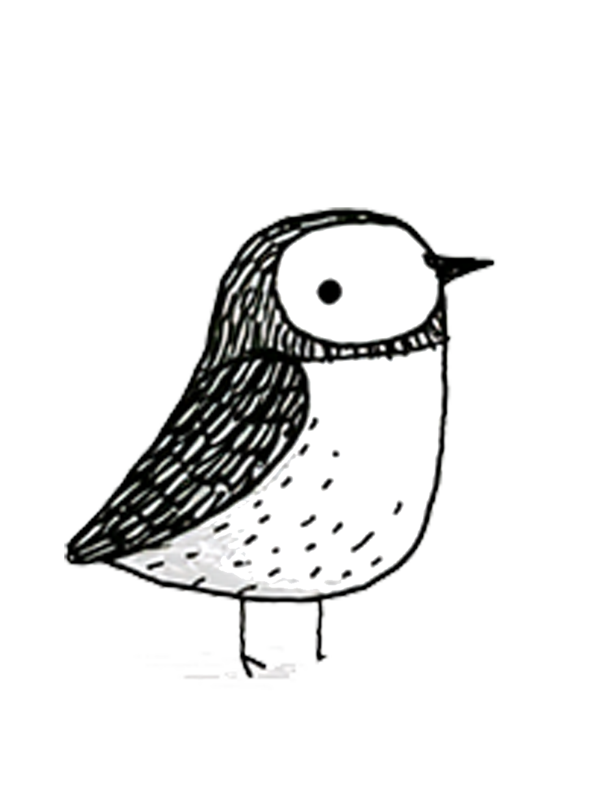 | Opção (5) | `active` | `5.icon-scandi-bird-1.png` | `icon-scandi-bird-1` | scandi bird 1 | Legado: `/icons/icon-scandi-bird-1.png` |
|  | Opção (6) | `active` | `7.icon-scandi-estrela-delicada.png` | `icon-scandi-estrela-delicada` | scandi estrela delicada | Legado: `/icons/icon-scandi-estrela-delicada.png` |
| 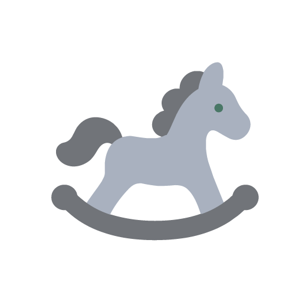 | Opção (7) | `active` | `_.icon-01.png` | `icon-escandinavo-acolhedor-icon-01` | escandinavo acolhedor icon 01 | ✨ **Novo** |
|  | Opção (8) | `active` | `_.icon-02.png` | `icon-escandinavo-acolhedor-icon-02` | escandinavo acolhedor icon 02 | ✨ **Novo** |
|  | Opção (9) | `active` | `_.icon-03.png` | `icon-escandinavo-acolhedor-icon-03` | escandinavo acolhedor icon 03 | ✨ **Novo** |
|  | Opção (10) | `active` | `_.icon-08.png` | `icon-escandinavo-acolhedor-icon-08` | escandinavo acolhedor icon 08 | ✨ **Novo** |

### Estilo: Essência Atemporal (ID 5) — Pasta: `essencia-atemporal/`

| Miniatura | Ordem | Status | Nome do Arquivo | ID Estável | Label | Origem / Nota |
|---|---|---|---|---|---|---|
|  | ⭐ **Top 1 (Destaque)** | `active` | `1.icon-_icon-essencia-florr-de-sal.png` | `icon-_icon-essencia-florr-de-sal` | essencia florr de sal | Legado: `/icons/icon-_icon-essencia-florr-de-sal.png` |
|  | ⭐ **Top 2 (Destaque)** | `active` | `2.icon-_icon-essencia-floral-do-mar.png` | `icon-_icon-essencia-floral-do-mar` | essencia floral do mar | Legado: `/icons/icon-_icon-essencia-floral-do-mar.png` |
| 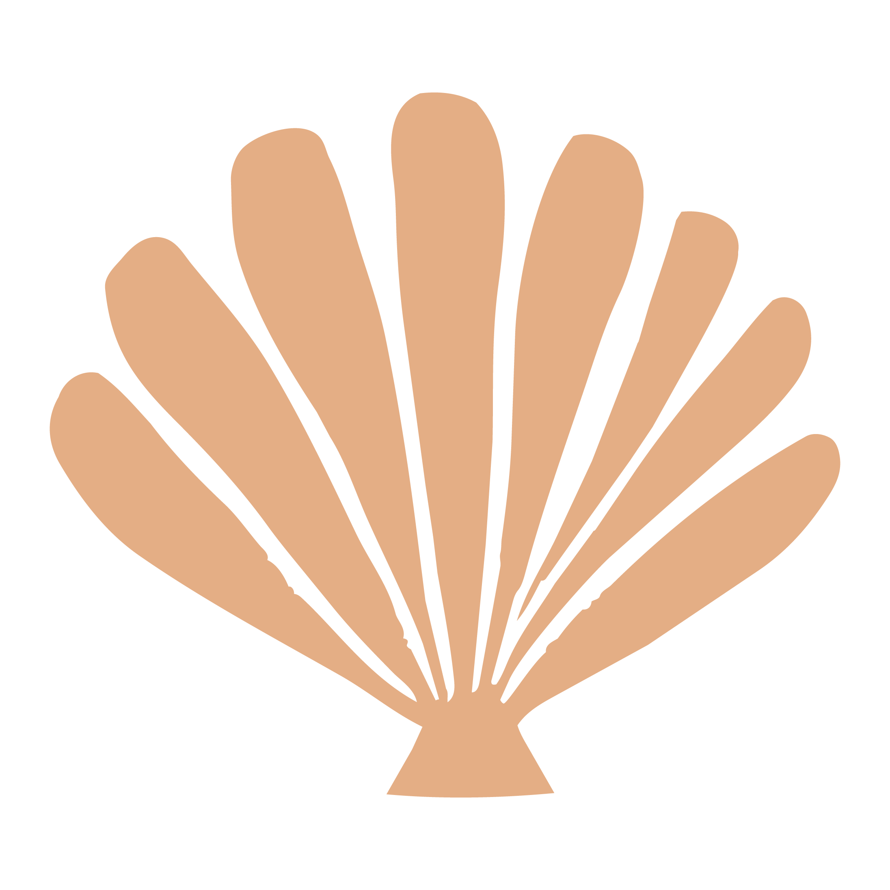 | ⭐ **Top 3 (Destaque)** | `active` | `3.icon-_icon-essencia-concha.png` | `icon-_icon-essencia-concha` | essencia concha | Legado: `/icons/icon-_icon-essencia-concha.png` |
|  | Opção (4) | `active` | `4.icon-_icon-essencia-organico-feminine.png` | `icon-_icon-essencia-organico-feminine` | essencia organico feminine | Legado: `/icons/icon-_icon-essencia-organico-feminine.png` |
|  | Opção (5) | `active` | `5.icon-_icon-essencia-folhas-trevo.png` | `icon-_icon-essencia-folhas-trevo` | essencia folhas trevo | Legado: `/icons/icon-_icon-essencia-folhas-trevo.png` |
|  | Opção (6) | `active` | `6.icon-_icon-essencia-floral-feminino.png` | `icon-_icon-essencia-floral-feminino` | essencia floral feminino | Legado: `/icons/icon-_icon-essencia-floral-feminino.png` |
| 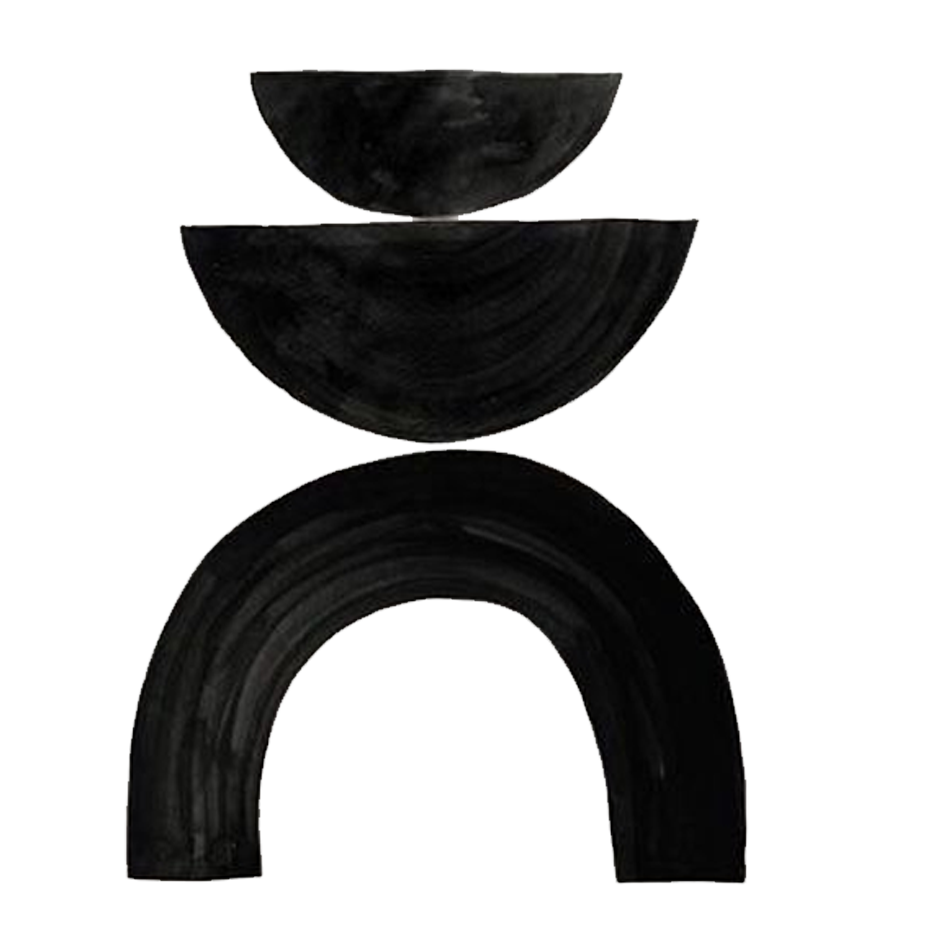 | Opção (7) | `active` | `7.icon-_icon-essencia-organico-masculino.png` | `icon-_icon-essencia-organico-masculino` | essencia organico masculino | Legado: `/icons/icon-_icon-essencia-organico-masculino.png` |

### Estilo: Estético Editorial (ID 11) — Pasta: `estetico-editorial/`

| Miniatura | Ordem | Status | Nome do Arquivo | ID Estável | Label | Origem / Nota |
|---|---|---|---|---|---|---|
| 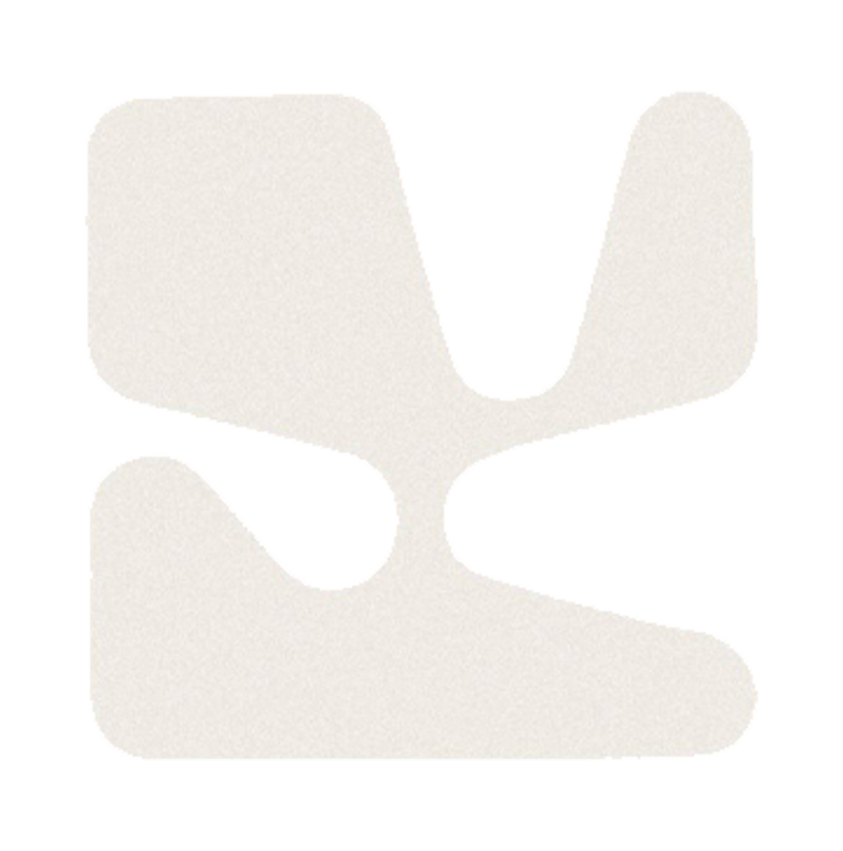 | ⭐ **Top 1 (Destaque)** | `active` | `1.icon-estetico-organico.png` | `icon-estetico-organico` | estetico organico | Legado: `/icons/icon-estetico-organico.png` |
| 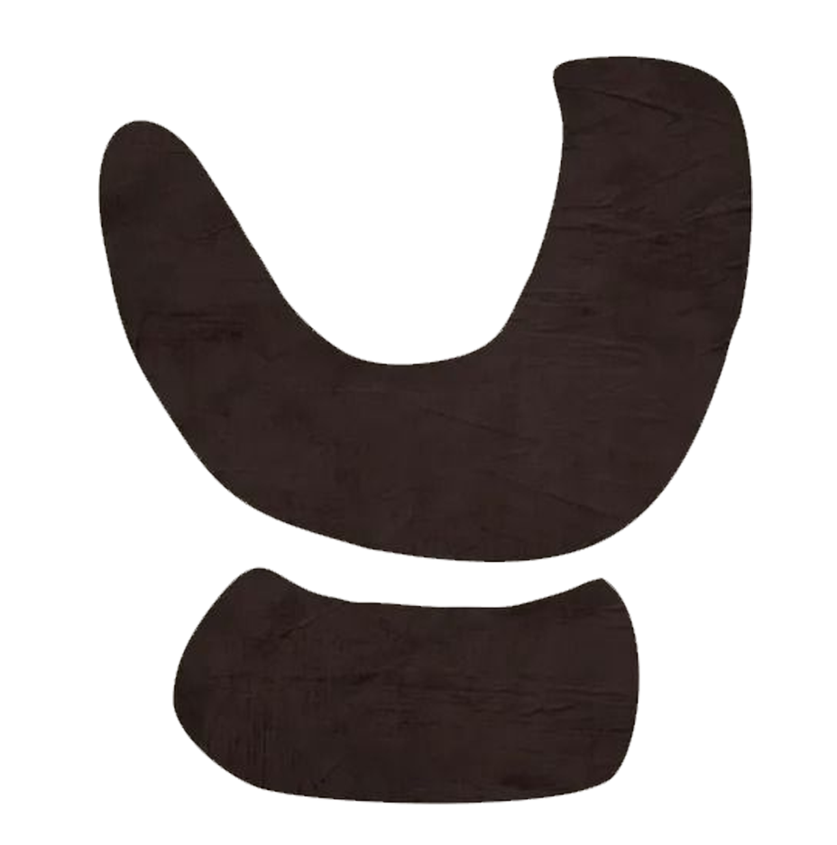 | ⭐ **Top 2 (Destaque)** | `active` | `2.icon-estetico-natural.png` | `icon-estetico-natural` | estetico natural | Legado: `/icons/icon-estetico-natural.png` |
|  | ⭐ **Top 3 (Destaque)** | `active` | `3.icon-estetico-flexibilidade.png` | `icon-estetico-flexibilidade` | estetico flexibilidade | Legado: `/icons/icon-estetico-flexibilidade.png` |
|  | Opção (4) | `active` | `4.icon-estetico-flexibilidade-2.png` | `icon-estetico-flexibilidade-2` | estetico flexibilidade 2 | Legado: `/icons/icon-estetico-flexibilidade-2.png` |
| 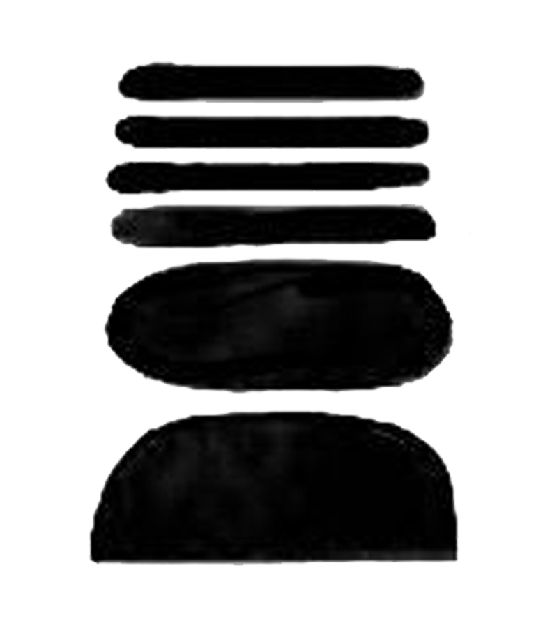 | Opção (5) | `active` | `5.icon-estetico-abstract 2.png` | `icon-estetico-abstract 2` | estetico abstract 2 | Legado: `/icons/icon-estetico-abstract 2.png` |
| 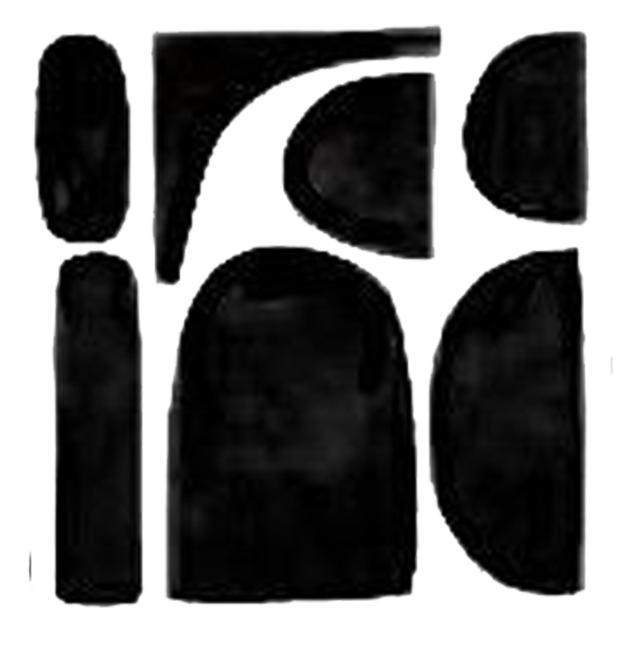 | Opção (6) | `active` | `6.icon-estetico-abstract 1.png` | `icon-estetico-abstract 1` | estetico abstract 1 | Legado: `/icons/icon-estetico-abstract 1.png` |
|  | Opção (7) | `active` | `7.icon-estetico-uniao.png` | `icon-estetico-uniao` | estetico uniao | Legado: `/icons/icon-estetico-uniao.png` |
| 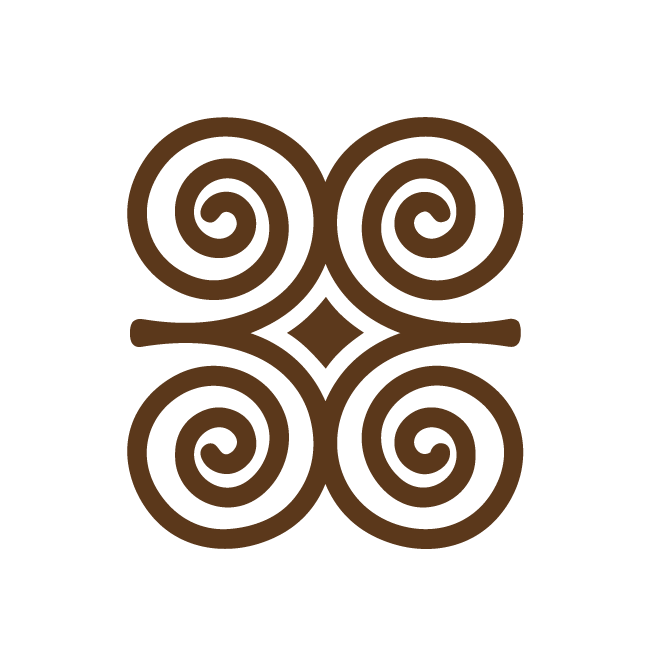 | Opção (8) | `active` | `icon-estetico-igualidade.png` | `icon-estetico-igualidade` | estetico igualidade | Legado: `/icons/icon-estetico-igualidade.png` |

### Estilo: Jardim Encantado (ID 2) — Pasta: `jardim-encantado/`

| Miniatura | Ordem | Status | Nome do Arquivo | ID Estável | Label | Origem / Nota |
|---|---|---|---|---|---|---|
| 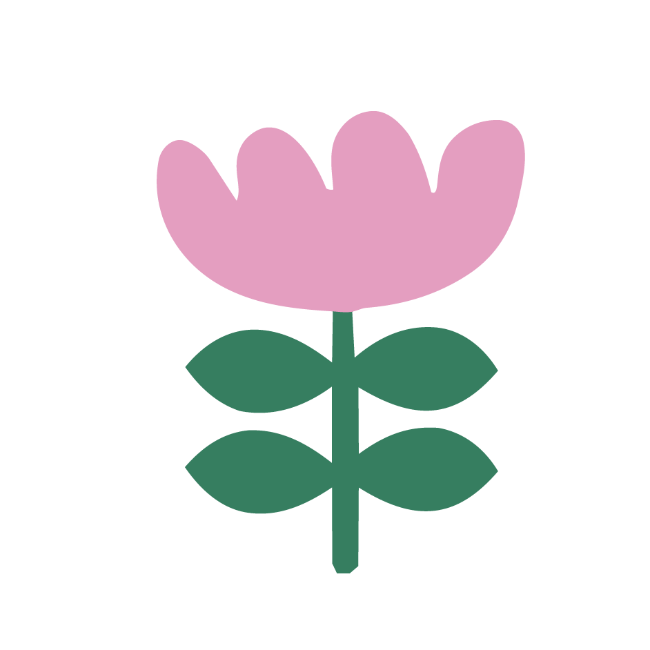 | ⭐ **Top 1 (Destaque)** | `active` | `1.icon-_icon-flor-delicadeza_suave.png` | `icon-_icon-flor-delicadeza_suave` | flor delicadeza suave | Legado: `/icons/icon-_icon-flor-delicadeza_suave.png` |
|  | ⭐ **Top 2 (Destaque)** | `active` | `2.icon-_icon-passaro-fofura_amigavel.png` | `icon-_icon-passaro-fofura_amigavel` | passaro fofura amigavel | Legado: `/icons/icon-_icon-passaro-fofura_amigavel.png` |
|  | ⭐ **Top 3 (Destaque)** | `active` | `3.icon-_icon-flor-de-tulips.png` | `icon-_icon-flor-de-tulips` | flor de tulips | Legado: `/icons/icon-_icon-flor-de-tulips.png` |
| 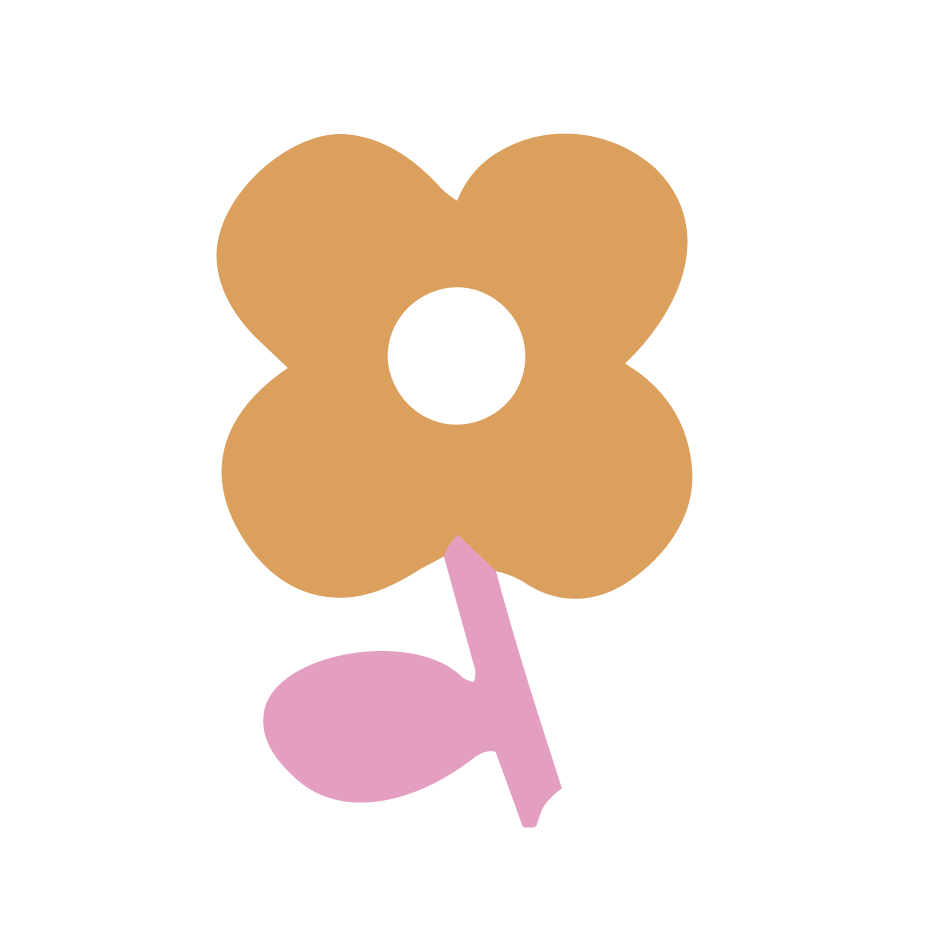 | Opção (4) | `active` | `4.icon-_icon-flor-ludico_divertido.png` | `icon-_icon-flor-ludico_divertido` | flor ludico divertido | Legado: `/icons/icon-_icon-flor-ludico_divertido.png` |
| 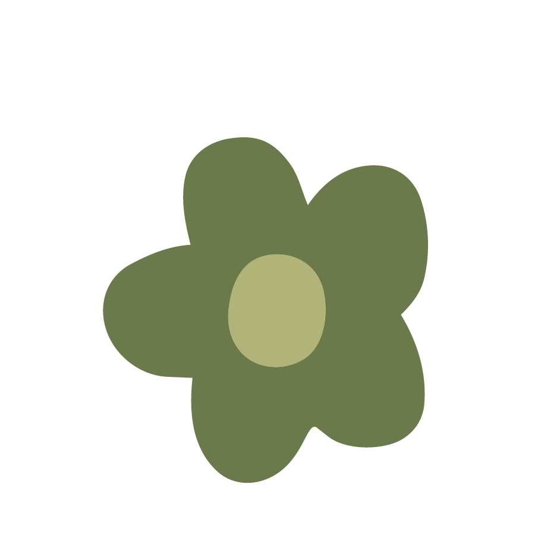 | Opção (5) | `active` | `5.icon-_icon-flor-simplicidade_feliz.png` | `icon-_icon-flor-simplicidade_feliz` | flor simplicidade feliz | Legado: `/icons/icon-_icon-flor-simplicidade_feliz.png` |
|  | Opção (6) | `active` | `6..icon-_icon-flor-amor_infantil.png` | `icon-_icon-flor-amor_infantil` | flor amor infantil | Legado: `/icons/icon-_icon-flor-amor_infantil.png` |

### Estilo: Raízes & Cuidado (ID 6) — Pasta: `raizes-e-cuidado/`

| Miniatura | Ordem | Status | Nome do Arquivo | ID Estável | Label | Origem / Nota |
|---|---|---|---|---|---|---|
| 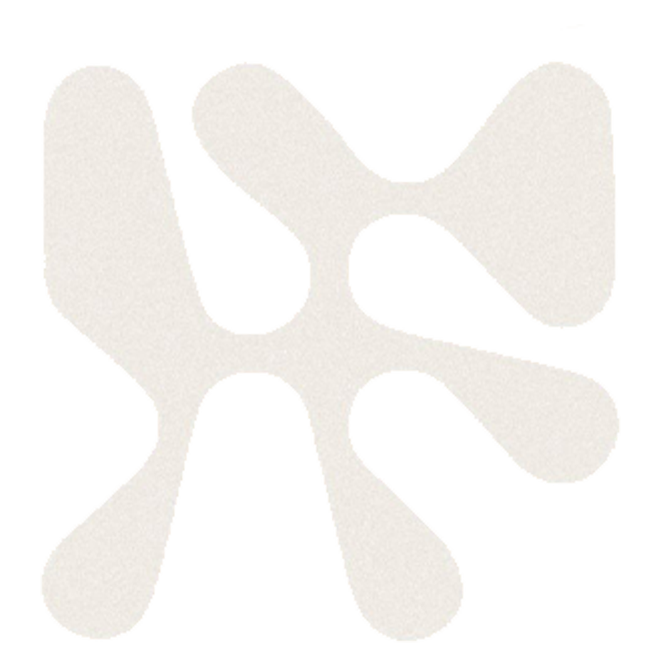 | ⭐ **Top 1 (Destaque)** | `active` | `1.icon-raiz-organico.png` | `icon-raiz-organico` | raiz organico | Legado: `/icons/icon-raiz-organico.png` |
|  | ⭐ **Top 2 (Destaque)** | `active` | `2.icon-raiz-naturral-organico-caule.png` | `icon-_icon-raiz-naturral-organico-caule` | raiz naturral organico caule | Legado: `/icons/icon-_icon-raiz-naturral-organico-caule.png` |
| 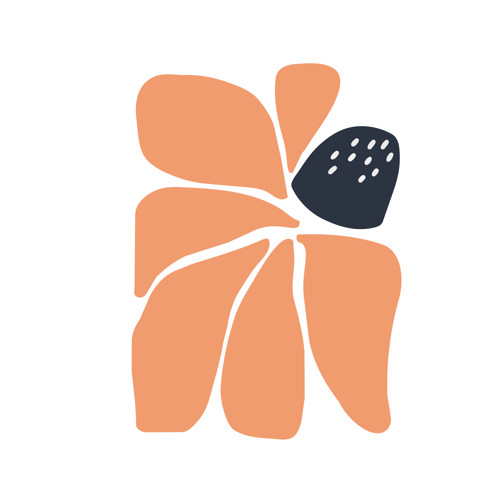 | ⭐ **Top 3 (Destaque)** | `active` | `3.icon-raiz-naturral-organico-flor-mdoerno-bold.png` | `icon-_icon-raiz-naturral-organico-flor-mdoerno-bold` | raiz naturral organico flor mdoerno bold | Legado: `/icons/icon-_icon-raiz-naturral-organico-flor-mdoerno-bold.png` |
|  | Opção (4) | `active` | `4.icon-raiz-naturral-organico-abstratoo.png` | `icon-_icon-raiz-naturral-organico-abstratoo` | raiz naturral organico abstratoo | Legado: `/icons/icon-_icon-raiz-naturral-organico-abstratoo.png` |
|  | Opção (5) | `active` | `5.icon-raiz-naturral-flor-de-sal.png` | `icon-_icon-raiz-naturral-flor-de-sal` | raiz naturral flor de sal | Legado: `/icons/icon-_icon-raiz-naturral-flor-de-sal.png` |
|  | Opção (6) | `active` | `6.icon-raiz-naturral-organico.png` | `icon-raiz-naturral-organico` | raiz naturral organico | Legado: `/icons/icon-raiz-naturral-organico.png` |
| 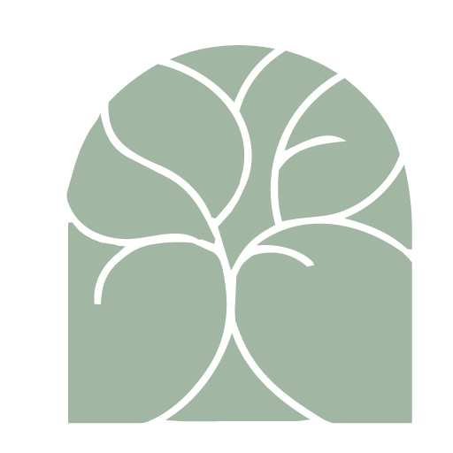 | Opção (7) | `active` | `Untitled-1.png` | `icon-raizes-e-cuidado-untitled-1` | raizes e cuidado Untitled 1 | ✨ **Novo** |
|  | Opção (8) | `active` | `icon-_icon-raiz-naturral-organico-circular.png` | `icon-_icon-raiz-naturral-organico-circular` | raiz naturral organico circular | Legado: `/icons/icon-_icon-raiz-naturral-organico-circular.png` |

